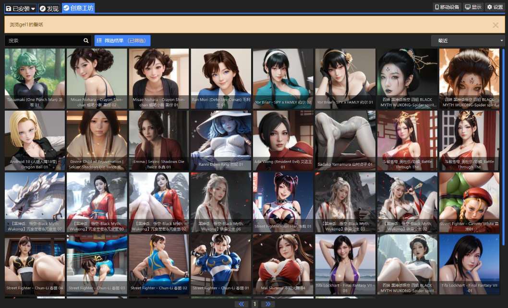
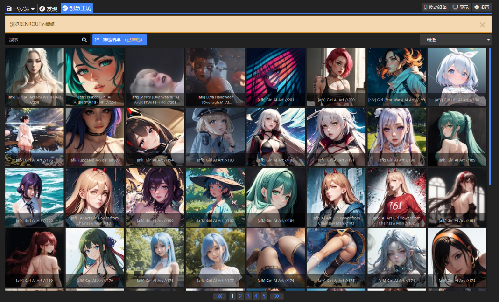

# WallpaperEngine-Block-AI
在浏览 WallpaperEngine 应用程序中浏览创意工坊时，总会出现那么几个 AI 作品:sweat:，关键是有一些 AI 作品的作者发布的作品不仅质量低而且作品量又多:shit:。因此通过添加用户屏蔽列表来隐藏​​这些低质量的 AI 作品。

> [!tip]
>
> 屏蔽情况举例：
>
> 
>
> 

> [!warning]
>
> - 由于在写代码时已经我的屏蔽的用户很多了，筛选起来过于麻烦，因此会导致屏蔽的作品除了 AI 外，还屏蔽了一些真人短视频之类的（只占了小部分，大部分还是屏蔽 AI）。
> - 屏蔽情况未考虑 R-18:underage: 分区的作品。

> [!important]
>
> - 运行代码前需先关闭 WallpaperEngine 应用程序。
> - 代码运行时会保留一份原先的配置文件并命名为 `config_backup.json`，位置在 wallpaper_engine 的安装目录下。

# 如何使用

1. 确保电脑具备 [node](https://nodejs.org/zh-cn) 环境

2. 拉取仓库或者下载仓库

3. 安装依赖

   ```(空)
   npm i
   ```

4. 运行

   ```(空)
   node BlockAI.js
   ```

   

